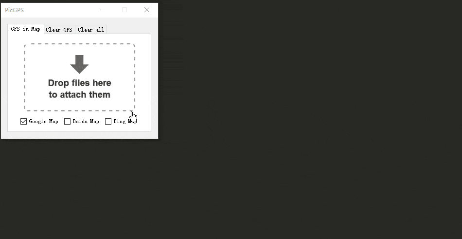

[Click to download](./released)

## Description

Nowadays, there is a growing tendency for people to take pictures with their everyday devices. Most of those devices have locating features connected with GPS or other locating services providers. However, people might not be aware of that their photos can somehow leak their position. When we post our photos to most sites like Instagram or weibo, the just compress it to get rid of the risk of leaking original information alongside the photo. However, sites like Flickr or more personal, amateurish forums might not even process your photo, which will expose the raw data of GPS, camera model, rating and more infos to anyone who has access to it. Sounds dangerous, huh?

PicGPSCleaner is a simple tool to remove the related GPS/All EXIF info contained in an image, especially designed for .jpg photo files taken with modern cell phones or DSLR cameras. Just for the case described above!

PicGPSCleaner - 一个用于 查看照片GPS 和 清除照片GPS 的小工具。

当今智能手机普及，在网络上发送原图时很容易暴露一些隐私数据如设备型号，GPS信息，照片评级等等。

本工具用来一键清除GPS数据，还你一组无后顾之忧的照片！同时，还可以一键查看照片GPS对应地图位置，免去自行输入EXIF的烦扰。

## Versions

### 20180908 v1.0.1

- added first version. passed all the testcases I designed.

## Usage

0. built with Microsoft .NET Framework 4.6.1, make sure you're on proper version of Windows.

1. launch the tool, choose from tabs

2. for GPS viewer, select 1 or more Map to see the GPS in real world map position

3. for GPS/All cleaner, drag-drop your images or choose from explorer. 
the images will be automatically processed and overwritten to its original place. so backup if needed!

4. (anti-virus) in case anti-virus software reports, just add to white-list. it writes to clipboard and might cause some false alarms.

## Keywords

easy | tool | GPS remover | GPS cleaner | EXIF remover | GPS lookup | photo GPS viewer

## More to add

- [Save image without sacrificing its quality](http://www.nullskull.com/articles/20030706.asp)

actually it does not hurt the quality of image with methods in current version of GDI implementation(?) hence not applied.

- what to preserve in removeAll method?

https://docs.microsoft.com/en-us/dotnet/api/system.drawing.imaging.propertyitem.id?view=netframework-4.7.2

from my perspective of view, some more info could be saved, such as DPI, dimensions, color space, etc. if you have better idea what to preserve, just PR me!

- Drifting

地图仍旧存在漂移的问题，不过不影响大致方位。大概有小于1000m的误差。

## Methods

最简单的避免隐私泄露的方法：存成png文件 - 因为png原生并不支持EXIF字段，除非刻意添加，否则不会暴露你的位置和设备型号。

更简单粗暴的方法：手机截图再发送……如果不在乎画质的话。
可是谁会在乎手机画质呢？——华为，国家平台，成就国家品牌！

## Refs

[EXIF standard](https://www.exif.org/Exif2-2.PDF)

[EXIV2: A C++ lib for metadata](http://www.exiv2.org/doc/index.html)

[HowTo: read-image-metadata](https://docs.microsoft.com/en-us/dotnet/framework/winforms/advanced/how-to-read-image-metadata)

[Apple Map API sample](https://www.apple.com/retail/unionsquare/)

[GPS坐标转百度地图坐标的方法](https://blog.csdn.net/gulansheng/article/details/44496185)

[metadata-extractor](https://github.com/drewnoakes/metadata-extractor)

[Some sample IDs for EXIF](https://github.com/drewnoakes/metadata-extractor/wiki/SampleOutput)

[GPS in C#](https://stackoverflow.com/questions/4983766/getting-gps-data-from-an-images-exif-in-c-sharp)

[Property IDs for an Image's EXIF](https://docs.microsoft.com/en-us/dotnet/api/system.drawing.imaging.propertyitem.id)

[Catch中return会执行finally](https://www.cnblogs.com/harmonyboy/p/3403729.html)
